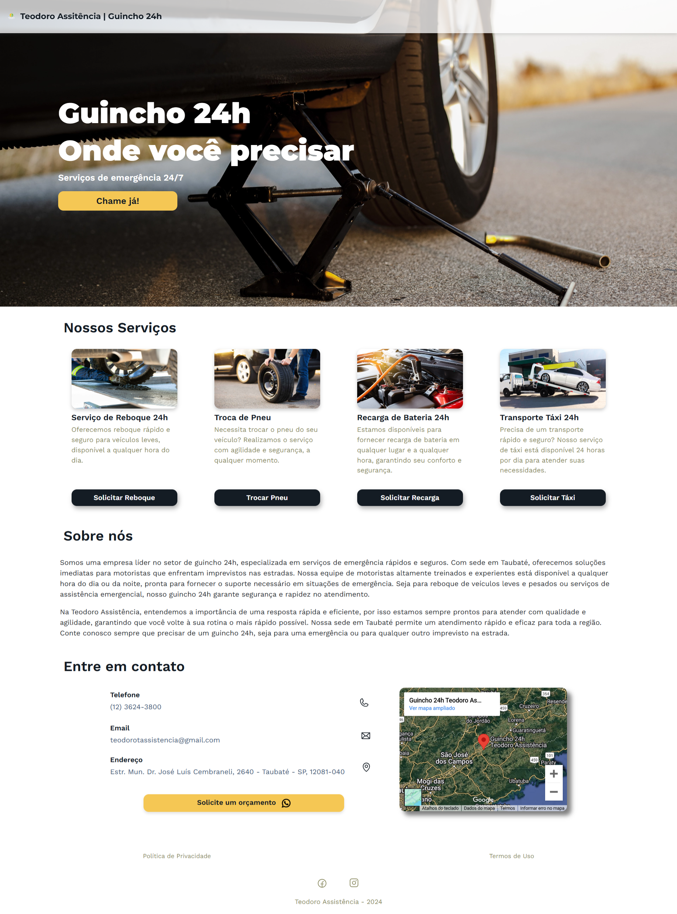

Teodoro Assistência | Guincho 24h - Website

Este é o site oficial da Teodoro Assistência, especializado em serviços de guincho 24 horas. O site oferece informações detalhadas sobre os serviços de emergência disponíveis, incluindo reboque de veículos, troca de pneus, recarga de bateria e serviço de táxi, tudo com a garantia de rapidez e segurança.

Funcionalidades:
Serviços de emergência 24h com chamadas diretas para o WhatsApp.
Design responsivo, garantindo uma experiência de usuário otimizada para dispositivos móveis e desktop.
Contato fácil via e-mail, telefone e mapa para localização.
Informações detalhadas sobre os serviços oferecidos e sobre a empresa.
Este projeto foi desenvolvido utilizando HTML, CSS, Bootstrap 5, e JavaScript. O código fonte está aberto para fins educativos e pode ser utilizado para quem deseja entender melhor as práticas de desenvolvimento web focadas em empresas de serviços.

Tecnologias:

HTML5
CSS3 (estilos personalizados);

Bootstrap 5;

JavaScript;

